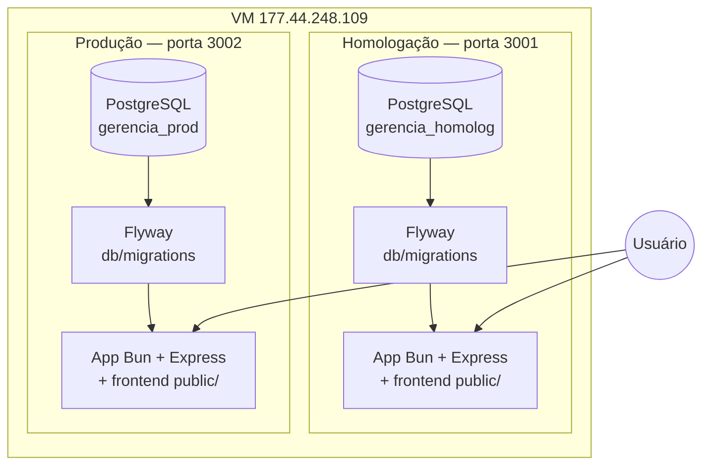
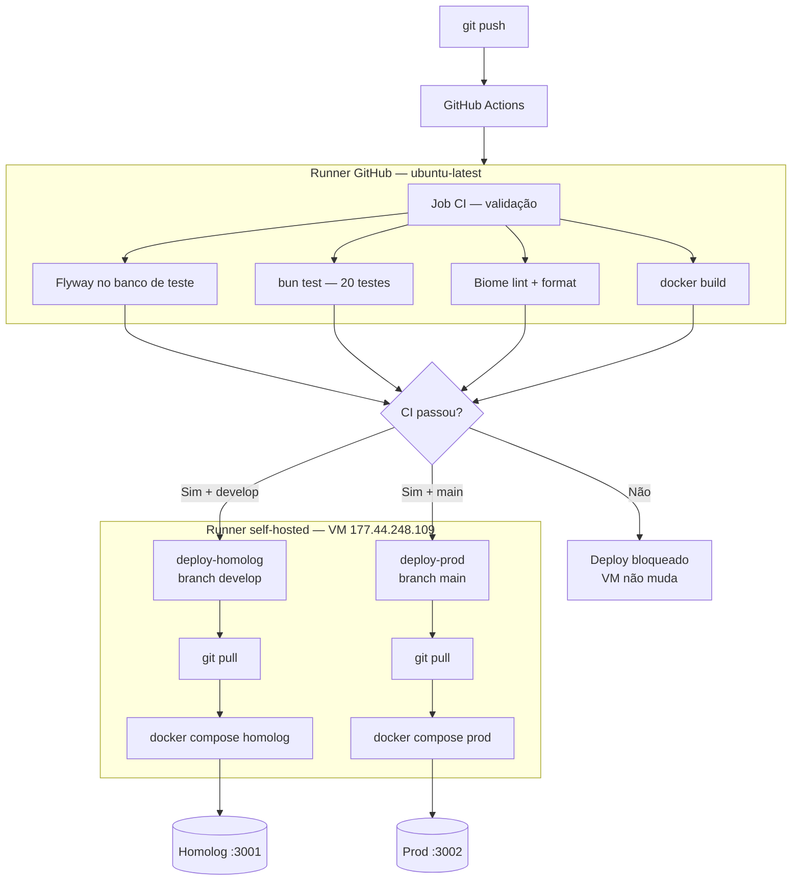
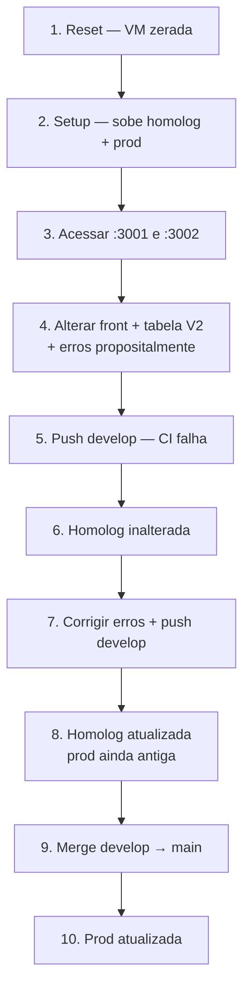
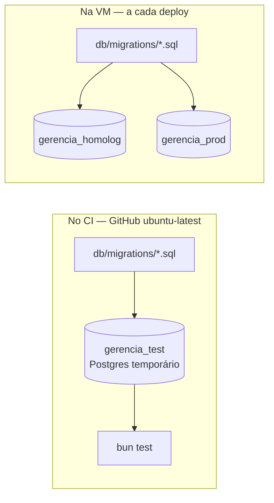

# Colinha — Apresentação Gerência de Configuração de Software

Guia rápido para demonstrar na VM **VMLS109** o fluxo completo: reset → setup → homolog/prod → CI/CD com erros → correção → produção.

---

## Informações fixas

| Item | Valor |
|------|-------|
| VM | `ssh root@177.44.248.109` (ou `univates@...`) |
| Diretório manual (setup/reset) | `/home/univates/gerencia` |
| Deploy automático (runner) | workspace do runner — onde o `checkout` baixa o código |
| Homologação | http://177.44.248.109:3001 |
| Produção | http://177.44.248.109:3002 |
| Login | `admin` / `admin123` |
| Branch homolog | `develop` |
| Branch produção | `main` |
| Repositório | https://github.com/lucasgiovanella/gerencia |

---

## Diagrama 1 — Arquitetura na VM

Cada ambiente (homolog e prod) é um stack Docker **isolado**, com banco, migração e app próprios.



---

## Diagrama 2 — Pipeline CI/CD

O pipeline tem **dois runners**: validação na nuvem do GitHub e deploy na VM via self-hosted runner.



---

## Como funciona o CI/CD e o self-hosted runner

O pipeline está em `.github/workflows/ci-cd.yml` e divide o trabalho em **dois momentos**:

### 1. Validação (job `ci`) — nuvem do GitHub

Roda em `ubuntu-latest` (máquina temporária do GitHub, não na sua VM). A cada push ou PR ele:

1. Baixa o código
2. Instala dependências com Bun
3. Roda **Flyway** num Postgres de teste
4. Roda **testes** (`bun test`)
5. Roda **Biome** (lint + formatação)
6. Valida o **docker build**

Se qualquer passo falhar, o workflow fica vermelho e **nenhum deploy é executado**.

### 2. Deploy (jobs `deploy-homolog` e `deploy-prod`) — self-hosted runner

Roda na **sua VM** (`runs-on: self-hosted`). É um agente do GitHub Actions instalado na máquina que:

- Fica conectado ao repositório aguardando jobs
- Só recebe trabalho **depois** que o job `ci` passa (`needs: ci`)
- Executa `docker compose` no **workspace do runner** (`${{ github.workspace }}` — pasta onde o `checkout` baixa o código)
- Não usa `/home/univates/gerencia` no deploy: essa pasta tem permissão restrita ao usuário `univates`
- O `checkout` já traz o commit certo — não precisa de `git pull`

| Job | Quando roda | O que faz na VM |
|-----|-------------|-----------------|
| `deploy-homolog` | push em `develop` | `git pull` + `docker compose` homolog (porta 3001) |
| `deploy-prod` | push em `main` | `git pull` + `docker compose` prod (porta 3002) |

**Por que self-hosted?** O deploy precisa acessar o Docker da VM, os volumes do banco e as portas 3001/3002. Isso não dá para fazer de um runner genérico na nuvem — o runner precisa estar **na mesma máquina** onde os containers rodam.

**Como verificar se está ativo:** GitHub → repositório → **Settings → Actions → Runners** → deve aparecer um runner **Idle** (verde).

**O que dizer na apresentação:** *"O GitHub valida o código na nuvem. Se passar, o runner instalado na nossa VM puxa o código e sobe os containers automaticamente."*

---

## Diagrama 3 — Roteiro da demonstração



---

## Como funciona o Biome

O **Biome** é a ferramenta de **lint** (análise de código) e **format** (padronização visual) do projeto. Garante que o backend TypeScript siga um padrão antes de ir para homolog ou produção.

### O que ele verifica

| Verificação | Comando no CI | O que faz |
|-------------|---------------|-----------|
| Lint | `bunx biome lint src/` | Detecta código suspeito, variáveis não usadas, más práticas |
| Format | `bunx biome format src/ --diagnostic-level=error` | Exige indentação, aspas e vírgulas no padrão definido |

### Configuração (`biome.json`)

- Analisa apenas a pasta **`src/`** (backend TypeScript)
- **Ignora:** `public/`, `testes/`, `node_modules/`
- Regras: indentação 2 espaços, aspas duplas, linha até 100 caracteres

### Na demonstração

- Alterar só `public/app.html` **não** dispara erro do Biome
- Para bloquear o pipeline, o erro precisa estar em `src/server.ts` (ou outro arquivo em `src/`)
- Quando o Biome falha, o job `ci` fica vermelho e o **self-hosted runner nem executa** o deploy

### Rodar localmente (antes do push)

```bash
bunx biome lint src/
bunx biome format src/ --diagnostic-level=error

# ou via Makefile
make lint
```

### Corrigir formatação automaticamente

```bash
bunx biome format src/ --write
```

---

## Como funciona o Flyway

O **Flyway** versiona o banco de dados com scripts SQL numerados. Cada mudança de schema é um arquivo em `db/migrations/` e o Flyway aplica só o que ainda não rodou.

### Convenção de nomes

```
db/migrations/V1__init.sql
db/migrations/V2__categoria.sql
```

Padrão: `V{versão}__{descrição}.sql`

### Onde o Flyway roda (dois contextos)



| Onde | Quando | Banco | Objetivo |
|------|--------|-------|----------|
| CI (GitHub) | A cada push/PR | `gerencia_test` | Garantir que migrações e testes funcionam juntos |
| VM homolog | Deploy `develop` | `gerencia_homolog` | Aplicar schema real de homologação |
| VM prod | Deploy `main` | `gerencia_prod` | Aplicar schema real de produção |

Na VM, o container `migrate` (imagem `redgate/flyway:10`) roda **antes** do app subir. Se a migração falhar, o app não inicia.

### Controle de versão no banco

O Flyway cria a tabela `flyway_schema_history` em cada banco:

```sql
SELECT version, description, success, installed_on
FROM flyway_schema_history
ORDER BY installed_rank;
```

Cada linha = uma migração já aplicada. O Flyway **nunca reaplica** um script que já consta nessa tabela.

### Na demonstração

1. Criar `V2__categoria.sql` e fazer push em `develop`
2. Se o CI passar, o deploy homolog aplica `V2` só em `gerencia_homolog`
3. Produção continua em `V1` até o merge em `main`
4. Mostrar a diferença consultando `flyway_schema_history` nos dois bancos

### Conferir na VM

```bash
# Homolog
docker exec -it gerencia_db_homolog psql -U postgres -d gerencia_homolog \
  -c "SELECT version, description FROM flyway_schema_history ORDER BY installed_rank;"

# Produção
docker exec -it gerencia_db_prod psql -U postgres -d gerencia_prod \
  -c "SELECT version, description FROM flyway_schema_history ORDER BY installed_rank;"
```

---

## PARTE 1 — Reset (VM zerada)

> Rode `cd /` antes, para não estar dentro de uma pasta que será apagada.

### Mostrar que está vazio

```bash
docker ps
docker images
ls /home/univates/gerencia 2>/dev/null || echo "pasta não existe"
ls /home/univates/projeto 2>/dev/null || echo "pasta não existe"
ls /root/projeto 2>/dev/null || echo "pasta não existe"
```

### Executar reset

```bash
cd /
curl -fsSL https://raw.githubusercontent.com/lucasgiovanella/gerencia/main/scripts/reset-vm.sh | CONFIRM_RESET=RESETAR bash
```

### Confirmar que apagou tudo

```bash
docker ps
docker images
docker volume ls
ls /home/univates/gerencia 2>/dev/null || echo "OK — removido"
ls /home/univates/projeto 2>/dev/null || echo "OK — removido"
ls /root/projeto 2>/dev/null || echo "OK — removido"
```

**O que o professor deve ver:** sem containers `gerencia_*`, sem imagens do projeto, sem pastas do repositório.

---

## PARTE 2 — Setup (criar tudo do zero)

```bash
curl -fsSL https://raw.githubusercontent.com/lucasgiovanella/gerencia/main/scripts/setup-vm.sh | bash
```

### Conferir

```bash
docker ps
```

**Esperado — 4 containers rodando:**

| Container | Porta |
|-----------|-------|
| `gerencia_app_homolog` | 3001 |
| `gerencia_db_homolog` | 5434 |
| `gerencia_app_prod` | 3002 |
| `gerencia_db_prod` | 5435 |

### Acessar no navegador

- Homolog: http://177.44.248.109:3001
- Prod: http://177.44.248.109:3002
- Login: `admin` / `admin123`

**O que mostrar:** os dois ambientes funcionando e com a mesma versão inicial.

---

## PARTE 3 — Alterações com erros (máquina local)

```bash
cd C:\Users\Lucas\Projetos\gerencia
git checkout develop
git pull origin develop
```

### 3a. Alteração visual no front

Arquivo: `public/app.html` — mudar o título ou adicionar um texto visível, ex.:

```html
<h1>Gerência Financeira — HOMOLOG v2</h1>
```

### 3b. Forçar erro do Biome (obrigatório em `src/`)

Arquivo: `src/server.ts` — adicionar linha inválida:

```typescript
const _erroBiome = "vai falhar no lint";
```

> Biome **não** verifica `public/`. O erro precisa estar em `src/`.

### 3c. Forçar erro de teste

Arquivo: `testes/04_lancamentos.test.ts` — alterar um expect:

```typescript
expect(res.status).toBe(999); // era 200
```

### 3d. Nova tabela no banco (Flyway)

Criar: `db/migrations/V2__categoria.sql`

```sql
CREATE TABLE IF NOT EXISTS categoria (
    id SERIAL PRIMARY KEY,
    nome VARCHAR(100) NOT NULL UNIQUE,
    situacao VARCHAR(20) NOT NULL DEFAULT 'ativo'
);

INSERT INTO categoria (nome) VALUES
('Alimentação'),
('Transporte'),
('Salário');
```

### 3e. Commit e push (deve falhar)

```bash
git add .
git commit -m "feat: categoria + front homolog (com erros propositalmente)"
git push origin develop
```

---

## PARTE 4 — Mostrar que falhou e homolog não mudou

1. Abrir **GitHub → Actions** — workflow vermelho (testes e/ou Biome).
2. Abrir http://177.44.248.109:3001 — **sem** alteração visual.
3. Abrir http://177.44.248.109:3002 — **sem** alteração.

### Conferir banco homolog (na VM)

```bash
docker exec -it gerencia_db_homolog psql -U postgres -d gerencia_homolog -c "\dt"
docker exec -it gerencia_db_homolog psql -U postgres -d gerencia_homolog -c "SELECT version FROM flyway_schema_history;"
```

**Esperado:** só tabelas `usuario` e `lancamento`, migração apenas `V1`.

---

## PARTE 5 — Corrigir e deploy em homolog

Na máquina local:

```bash
# Remover erro do Biome em src/server.ts
# Corrigir expect nos testes
# Manter: public/app.html e V2__categoria.sql

git add .
git commit -m "fix: corrige lint e testes para deploy homolog"
git push origin develop
```

Aguardar CI verde (~2–5 min).

### Verificar

| Onde | O que esperar |
|------|----------------|
| http://177.44.248.109:3001 | Alteração visual visível |
| http://177.44.248.109:3002 | Versão antiga (sem mudança) |

### Conferir Flyway só em homolog

```bash
docker exec -it gerencia_db_homolog psql -U postgres -d gerencia_homolog -c "\dt"
docker exec -it gerencia_db_homolog psql -U postgres -d gerencia_homolog -c "SELECT version, description FROM flyway_schema_history ORDER BY installed_rank;"
docker exec -it gerencia_db_prod psql -U postgres -d gerencia_prod -c "SELECT version FROM flyway_schema_history;"
```

**Esperado:** homolog com `V1` e `V2`; prod só com `V1`.

---

## PARTE 6 — Enviar para produção

```bash
git checkout main
git pull origin main
git merge develop
git push origin main
```

Aguardar CI verde + deploy-prod.

### Verificar

| Onde | O que esperar |
|------|----------------|
| http://177.44.248.109:3001 | Com alterações |
| http://177.44.248.109:3002 | Agora também com alterações |

```bash
docker exec -it gerencia_db_prod psql -U postgres -d gerencia_prod -c "SELECT version FROM flyway_schema_history;"
docker exec -it gerencia_db_prod psql -U postgres -d gerencia_prod -c "SELECT * FROM categoria;"
```

---

## Comandos úteis durante a apresentação

```bash
# Status dos containers
docker ps

# Logs homolog
cd /home/univates/gerencia
docker compose -f docker-compose.homolog.yml logs -f app

# Logs prod
docker compose -f docker-compose.prod.yml logs -f app

# Reiniciar manualmente (se necessário)
docker compose -f docker-compose.homolog.yml up -d --build
docker compose -f docker-compose.prod.yml up -d --build
```

---

## Checklist antes da apresentação

- [ ] Runner self-hosted **Idle** no GitHub (Settings → Actions → Runners)
- [ ] Reset + setup testados uma vez na VM
- [ ] Push de teste em `develop` confirmou deploy automático em homolog
- [ ] Arquivos de erro/correção preparados localmente (ou em branch)
- [ ] URLs corretas: **3001** homolog, **3002** prod

---

## Observações importantes

| Tópico | Detalhe |
|--------|---------|
| Self-hosted runner | Deploy roda **na VM**; validação (testes/Biome/Flyway CI) roda no **GitHub ubuntu-latest** |
| Reset via pipe | `CONFIRM_RESET=RESETAR` vai **antes** do `bash`, não do `curl` |
| Branch homolog | É `develop`, não existe branch `homolog` |
| Biome | Só analisa `src/` — erro de padrão precisa estar no backend |
| Flyway CI vs VM | CI testa migrações em banco temporário; VM aplica em homolog/prod separados |
| Bancos | Homolog e prod são **independentes** (volumes separados) |
| Migrações | Versionadas em `flyway_schema_history` — cada ambiente evolui no seu ritmo |
